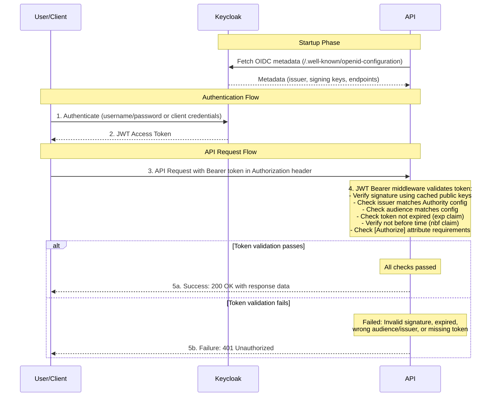

Morsley.UK.Security
===================

Goal: To better undersatned OAuth 2.0

I will eventually need to implement some form of security on my APIs.
OAuth 2.0 seems to be the industry standard mechanism for doing this.
The API will then accept a token (usuallt JWT) from the calling application.
The API verifies the token's:

- Signature (ensures it's genuine)
- Audience (it's meant for this API)
- Issuer (trusted authority)
- Expiration (still valid)

If the token checks out, access is granted.
If not, the API rejects with ```401 Unauthorized```

As I intend to put my finished API on Azure, I will be using Azure Entra ID. 
This supports both authentication and authorization.
For local development, I will be using Keycloak (within Docker).
Both Entra ID and Keycloak utilise OAuth 2.0 and OpenID Connect.

---

OAuth 2.0
---------

OAuth 2.0 defines how applications get delegated access to APIs on behalf of a user or service.

Used for:

- Getting access tokens
- Authorizing clients (apps) to access resources (APIs)
- Handling permissions/scopes

For example:

- A client app (e.g., SPA or mobile app) gets an access token from Entra ID or Keycloak.
- That token is used to call a protected API (our ASP.NET API).
- The API validates the token (signature, audience, etc.) before allowing access.

---

Requires the following credentials:

1. Client Id
2. Client Secret

Returns: Token

JWT: JSON Web Token

HTTPS is a must when using JWT, as they always use TLS.

Note:
-----

We are setting 'TokenValidationParameters.ValidateAudience = false' becuase it is not part of the OAuth2 standard.
We will be using an authorization policy instead.

Good website: jwt.io

Sequence Diagram
----------------

