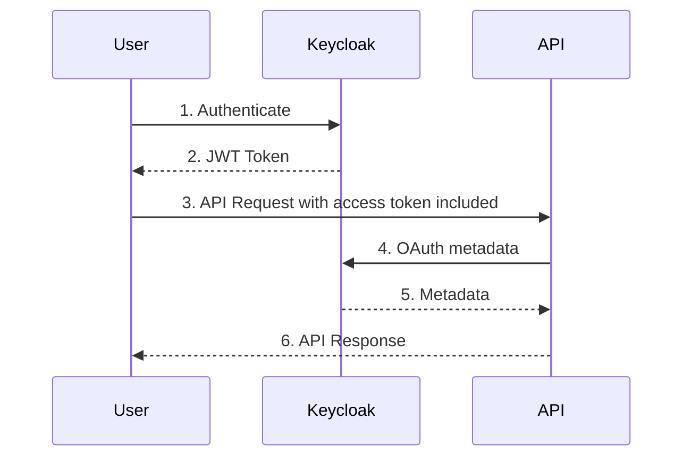

Morsley.UK.Security
===================

Here we will be using OAuth2.

Token Source: Identity Provider

Requires the following credentials:

1. Client Id
2. Client Secret

Returns: Token

JWT: JSON Web Token

HTTPS is a must when using JWT, as they always use TLS.

Note:
-----

We are setting 'TokenValidationParameters.ValidateAudience = false' becuase it is not part of the OAuth2 standard.
We will be using an authorization policy instead.

Q: What cloud solutions are there on Azure?
A: Azure Entra ID (I think).

jwt.io

Sequence Diagram
----------------

